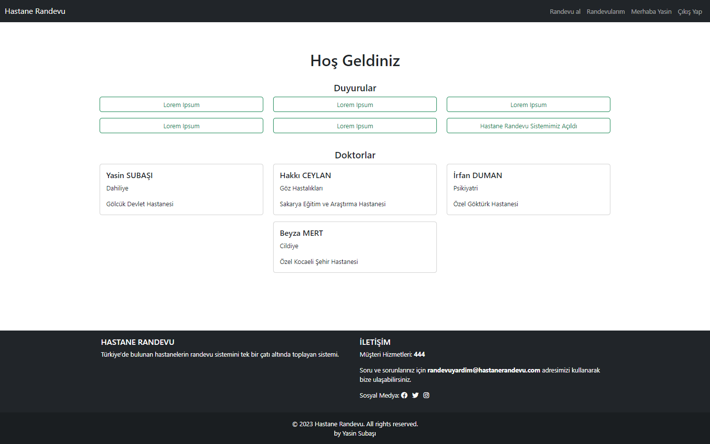
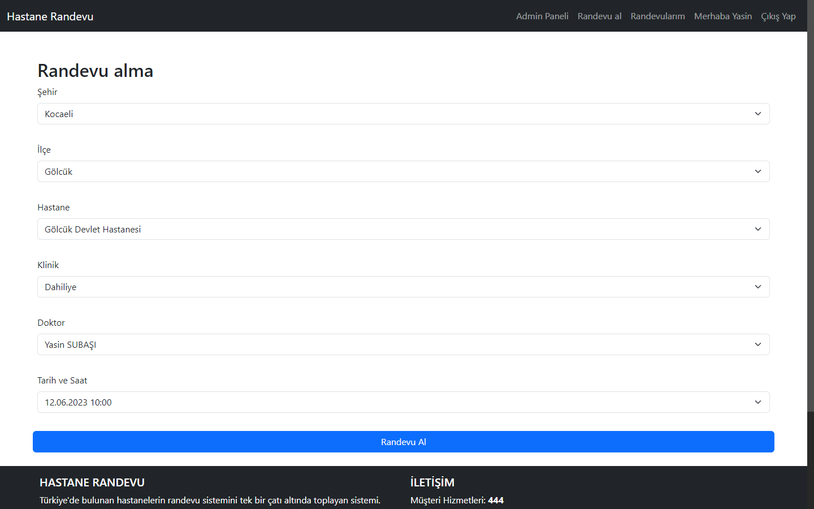
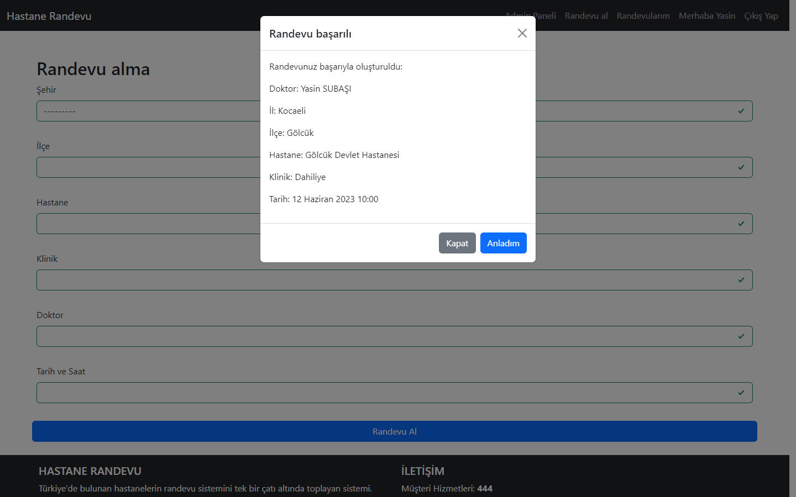
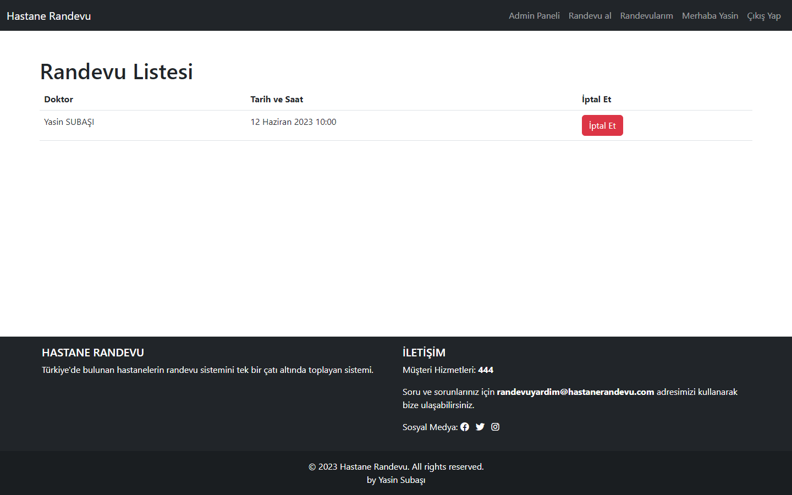
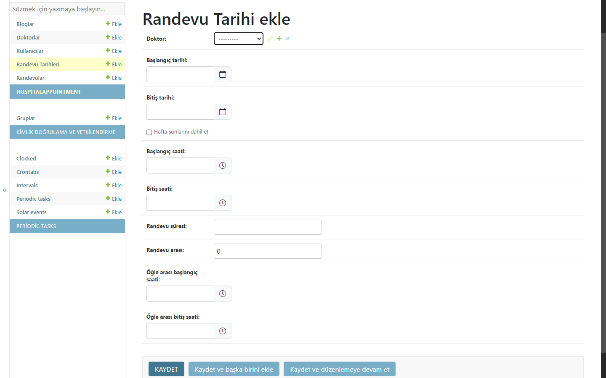
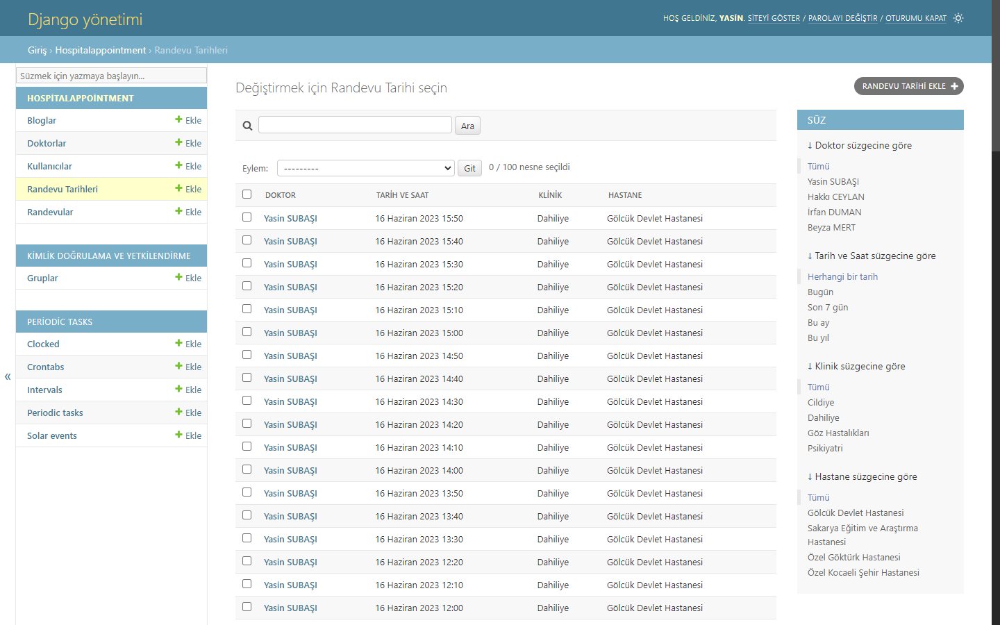
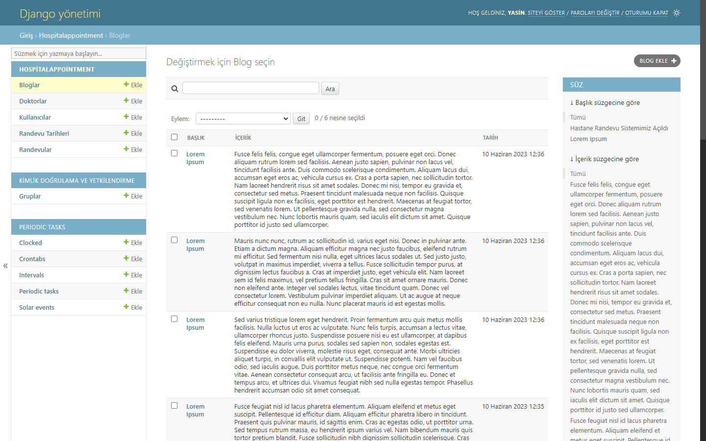
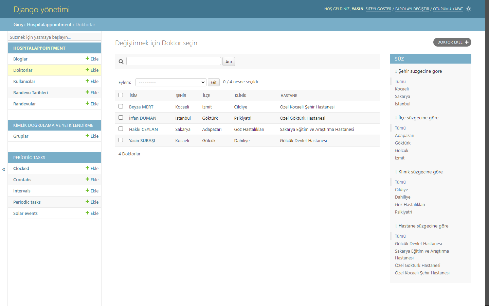

[](https://www.python.org/)
[](https://github.com/bertek41/HospitalAppointment/blob/main/LICENSE)

# Hospital Appointment

This project includes the basic functionalities of a hospital appointment system. It allows patients to schedule appointments and enables doctors to view and manage the appointments.

## Installation

Use the package manager [pip](https://pip.pypa.io/en/stable/) to install requirements and then use [Docker](https://docs.docker.com/compose/install/).

```bash
pip install -r requirements.txt
docker-compose up
```
## Images
<details>
<summary>See images</summary>










</details>

## Contributing

Pull requests are welcome. For major changes, please open an issue first
to discuss what you would like to change.

Please make sure to update tests as appropriate.

## License

[GNU AGPLv3](https://choosealicense.com/licenses/agpl-3.0/)
